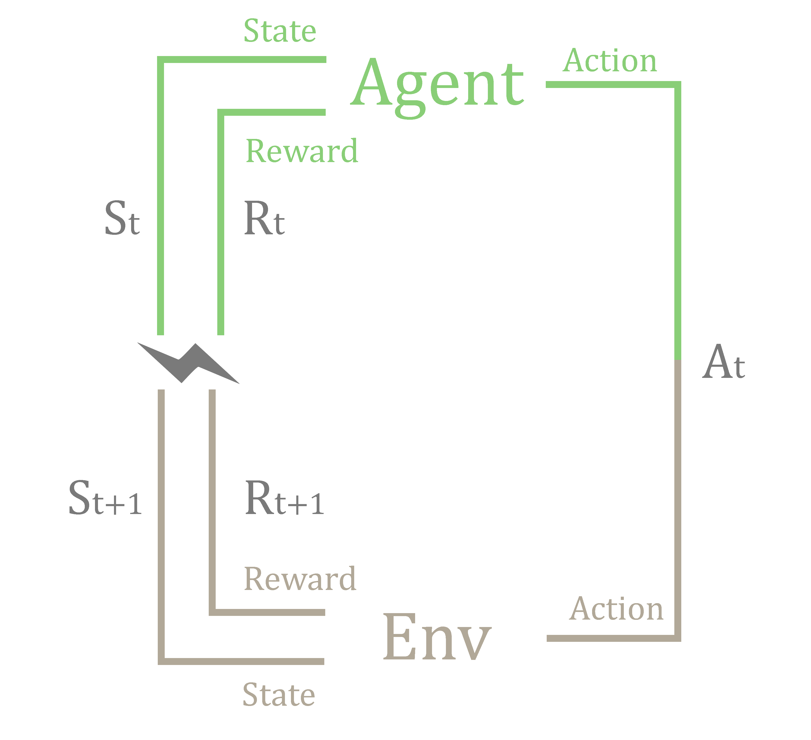

# Reinforcement Learning

## Machine Learning

Machine Learning is a subfield of Computer Science and Artificial Intelligence (AI). It aims at creating entities capable of learning from examples. What distinguishes it from other AI approaches is the special emphasis on avoiding explicit programming for the task at hand, instead relying only on examples (data) to solve it and from there generalizing to previously unseen cases. So at the heart of this approach lies data. In the classical machine learning setting the algorithm is provided with a set of questions and answers. Then after a period of computations over the pairs questions-answers, the algorithm is presented with new questions, some of them never seen before, that must be answered well enough.

The formalization of this setting leads to an approach known as Supervised Learning, where the questions-answers pairs are codified into mathematical objects, usually numeric vectors for questions and real numbers or categories for answers and the proposed solution comes in the form of a function that maps questions to answers. The name supervised comes from the fact that the algorithm is provided with the answers to the questions, so in a figurative way it is being supervised by a teacher.

Deviation from this classical setting leads to the other broad categories of machine learning. Unsupervised Learning algorithms are provided with just data (questions and not answers) and aim to uncover some structure in such data. Semisupervised Learning is halfway between Unsupervised and Supervised methods as only some answers are given, thus the algorithm must first find some structure on the questions (Unsupervised) to extend the answers to similar questions and then perform Supervised Learning. Finally, Reinforcement Learning algorithms get data and answers, but answers have only a grade on how favorable they are. The data and grades are obtained through interaction with an environment and the task here is to find answers that maximize the obtained grades.

## Reinforcement Learning

The contents of this section have mostly been adapted from Sutton and Barto's Introduction to Reinforcement Learning book [@sutton2018reinforcement].

Reinforcement Learning (RL) aims to develop algorithms that can satisfactorily inform an agent which decisions to make in order to achieve a goal. The world in which the agent acts is called the environment. The decisions made by the agent could affect the environment and hopefully drive it closer to the goal. A signal of how well the agent is performing is received at each decision step. The signal is called reward and it is an abstraction to represent great or poor sequences of actions. Plenty of this reward signal mean a successful agent closer to its objective.

The Reinforcement Learning Problem could be formalized with Markov Decision Processes (MDPs). The MDP framework models the interaction between an agent and an environment. The agent takes actions and the environment responds with observations and a reward signal, this process is repeated until termination or forever. The non-terminating case is known as a continuing task and the terminating one as an episodic task.
 
So at each time step  $t=0,1,2,3,...,T$ the agent using the information of state $S_t \in S$ of the environment must choose an action $A_t \in \mathcal{A}(S_t)$ from the available ones, then in the next time step $t+1$ the environment transits to a new state $S_{t+1} \in \mathcal{S}$ and returns a reward $R_t \in \mathcal{R} \subset \mathds{R}$. The dynamics between the agent and environment produces a trajectory of states, actions and rewards indexed by time.
$$ S_0, A_0, R_1, S_1, A_1, R_2, S_2, A_2, R_3, ...$$
 
Of special importance is the case of a finite MDP, in which the cardinality of states, actions and rewards ($\mathcal{S}$, $\mathcal{A}$ and $\mathcal{R}$) is finite. In a finite MDP the random variables $S_t$, $R_t$ have well defined discrete probability distributions that depend only on the previous action $A_{t-1}$ and state $S_{t-1}$. This is known as the Markov property:
$$ p(s’, r | s, a) \doteq \text{Pr}(S_t=s’,\ R_t=r\ |\ S_{t-1}=s,\ A_{t-1}=a) $$

This $p: \mathcal{S} \times \mathcal{R} \times \mathcal{S} \times \mathcal{A} \rightarrow [0,1]$ function is known as the _dynamics of the MDP_. The "$|$" (bar) symbol instead of a "$,$" (comma) in the function arguments is just a reminder that $p$ is calculating a conditional probability given $s$ and $a$. From here on the assumed $MDP$ would be a finite one.

(ref:env-agent-interactions) Diagram of the _Agent-Environment system_ formalized as a MDP. At time step $t$ the "Agent" with knowledge of observation $S_t$ and reward $R_t$ performs action $A_t$ to which the "Environment" responds with a new observation $S_{t+1}$ and reward $R_{t+1}$, the cycle is iterated. Figure adapted from [@sutton2018reinforcement].
```{r env-agent-interactions, fig.cap='(ref:env-agent-interactions)', out.width='80%', fig.asp=.75, fig.align='center', echo=FALSE}

```

(ref:rl-algorithm-type) Broad classification of Reinforcement Learning algorithms. Adapted from David Silver's Lecture *https://www.youtube.com/watch?v=2pWv7GOvuf0&t=1163s*.
```{r rl-algorithm-type, fig.cap='(ref:rl-algorithm-type)', out.width='80%', fig.asp=.75, fig.align='center', echo=FALSE}
knitr::include_graphics('pics/rl_families.pdf')
```

(ref:rl-relations) Broad relations between different types of strategies to solve the Reinforcement Learning Problem. Adapted from David Silver's Lecture *https://www.youtube.com/watch?v=2pWv7GOvuf0&t=1163s*.
```{r rl-relations, fig.cap='(ref:rl-relations)', out.width='80%', fig.asp=.75, fig.align='center', echo=FALSE}
knitr::include_graphics('pics/rl_families_relations.pdf')
```

### Goals and Return

The reward signal must guide the agent into achieving a goal. The hint that the sequence of rewards provides is such that if the agent maximizes the total amount of received rewards, the goal would be reached. Thus the agent objective turns to, not maximizing immediate reward, but instead cumulative reward in the long run. This informal idea is known as the _reward hypothesis_ and it is stated as follows:

> "All of what we mean by goals and purposes can be well thought of as the maximization of the expected value of the cumulative sum of a received scalar signal." [@sutton2018reinforcement]

In practice, when designing a RL task rewards can be thought of being of two types:

1. **Sparse:** Rewards are only given when the goal is reached.
2. **Shaped:** Rewards are also given when reaching subgoals.

Sparse rewards are preferred since the reward signal should only communicate the _what_ we want to accomplish and not the _how_. Similarly the RL framework provides better ways of inserting domain knowledge into the system, like in the initial policy or the initial value function. So it is not surprising that shaped rewards can bias learning when the subgoals are not aligned with the final goal or when accomplishing them is given more importance by the agent. Nonetheless, if well designed, shaped rewards can accelerate learning and are often much easier to learn from.

To formalize the previous discussion, the random variable $G_t$ _return_ is defined, for the time step $t$ in an episodic task with final step $T$:
$$ G_t \doteq R_{t+1} + R_{t+2} + R_{t+3} + ... + R_{T}$$

To handle the continuing task case, where $T=\infty$, the notion of _return_ can be extended by the inclusion of the discounting parameter $\gamma \in [0-1]$.
$$G_t \doteq \sum_{k=0}^{\infty} \gamma^k R_{t+1+k}$$
This _return_ formulation converges to a finite value if $\gamma < 1$ and the reward sequence $R_k$ is bounded. The parameter $\gamma$ represents how much weight far away rewards must be given, specifically a discount of $\gamma^{k-1}$ for the reward $R_{t+k}$, $k$ steps into the future. If $\gamma = 0$, the agent is "myopic" and is only concerned with maximizing immediate rewards. On the other hand as $\gamma$ approaches 1, more and more distant rewards are being taken into account, thus the agent becomes more farsighted.

A generalization of _return_ that combines both, episodic and continuing setting is as follows:
$$G_t \doteq \sum_{k=0}^{T} \gamma^k R_{t+1+k}$$
Where $T$ is turned into a parameter of future steps to take into account by the convention that if the episode terminates, all the futures rewards would be $0$. So in this formulation $T$ could be unbounded ($T = \infty$) or $\gamma = 1$, but not both at the same time.

The return $G_t$ at time $t$ follows and important recursive relation:
$$G_t = R_{t+1} + \gamma G_{t+1}$$

### Policy

A _policy_ $\pi$ is a mapping from states to probabilities of selecting each particular action. Formally a function of $2$ arguments, where the symbol "$|$" is just to remind us that the action depends on the state.
$$ \pi(a|s) \doteq \text{Pr}[A_t=a | S_t=s], \quad \forall s \in \mathcal{S}, \forall a \in \mathcal{A}$$
Policy codifies the behavior of the agent in the face of environment states. A well performing policy is one that generates behavior that gets the agent closer to its goal. An optimal policy is one that accomplishes the goal. Reinforcement Learning algorithms must find policies that maximize the _expected return_, since by the _reward hypothesis_ this is the same as accomplishing the goal. In other words the problem that RL is trying to solve is to find a policy $\pi$ that maximizes the _expected return_ $\underset {\pi} \max\ \mathds{E}_\pi G_t$.

### Value Functions

Value functions capture the idea of how desirable each state is. They are always discussed in the context of a particular policy $\pi$. A whole family of methods uses them to solve the RL problem.

The _value function_ $v_\pi(s)$ of a state $s$ under a policy $\pi$ is defined as:
$$v_\pi(s) \doteq \mathds{E}_\pi [ G_t | S_t = s ], \quad \forall s \in \mathcal{S}$$
$$v_\pi(s) = \mathds{E}_\pi \bigg[ \sum_{k=0}^{\infty} \gamma^k R_{t+1+k} \bigg| S_t = s \bigg], \quad \forall s \in \mathcal{S}$$

Similarly for action-state pairs ($a \in \mathcal{A}$, $s \in \mathcal{S}$) the _action-value_ function for policy $\pi$, $q_\pi(s,a)$ is defined:
$$ q_\pi(s,a) \doteq \mathds{E}_\pi [ G_t | S_t=s, A_t=a], \quad \forall s \in \mathcal{S}, \forall a \in \mathcal{A}$$
$$ q_\pi(s,a) = \mathds{E}_\pi \bigg[ \sum_{k=0}^{\infty} \gamma^k R_{t+1+k} \bigg| S_t = s, A_t = a \bigg], \quad \forall s \in \mathcal{S}, \forall a \in \mathcal{A}$$

The function $q_\pi$ represents the value of forcing the agent into taking action $a$ and then following the policy $\pi$.

The functions $v_\pi$ and $q_\pi$ can be estimated from interaction with the environment. The average, per state $s$, of rewards obtained following the policy $\pi$ will converge to $v_\pi(s)$. Similarly, if keeping track of state-action pairs, $q_\pi(s,a)$ can be estimated by the same method.

A fundamental property of value functions is that they satisfy a recursive relationship known as the _Bellman's Equation_:
$$v_\pi(s) = \sum_{a} \pi(a|s) \sum_{s',r} p(s',r|s,a) \big[ r + \gamma v_\pi(s') \big], \quad \forall s \in \mathcal{S} $$

If the dynamics of the environment are completely known, the _Bellman's Equation_ can be used to obtain the value function $v_\pi$ for all states since a system of linear $|\mathcal{S}|$ equations with $|\mathcal{S}|$ unknowns arises.

Similarly the _Bellman's Equation_ for value-action functions is:
$$q_\pi(s,a) = \sum_{s',r} p(s',r|s,a) \big[ r + \gamma \sum_{a'} \pi(s'|a')\ q_\pi(s',a') \big], \quad \forall s \in \mathcal{S}, \forall a \in \mathcal{A} $$

### Optimal Policies

Solving the Reinforcement Learning problem can be seen as finding a policy that achieves a high expected return. For finite MDPs the concept of an _optimal policy_ can be defined. Value functions can be used to order policies in the following way: A policy $\pi$ is said to be better than other policy $\pi'$ if and only if $v_\pi(s) \geq v_{\pi'}(s)$ for all $s \in \mathcal{S}$. Thus value functions define a partial ordering over policies, that is to say:
$$ \pi \geq \pi'\ \text{if and only if}\ v_\pi(s) \geq v_{\pi'}(s), \quad \forall s \in \mathcal{S}$$
There is always at least one policy that is better than or equal to all other. The policies with this property are named _optimal policies_ and are denoted by $\pi_*$. The value function under an _optimal policy_ (_optimal state-value function_) is written $v_*$ and can be expressed as:
$$v_*(s) \doteq \underset {\pi} {\max}\ v_\pi(s), \quad \forall s \in \mathcal{S}$$
In the same fashion, an _optimal action-value function_ is defined as:
$$q_*(s,a) \doteq \underset {\pi} {\max}\ q_\pi(s,a), \quad \forall s \in \mathcal{S}, \forall a \in \mathcal{A}$$
_Bellman's  equation_ for value functions 
can be rewritten for the _optimal state-value function_. Intuitively it represents the agent perfectly responding with the best action to any situation of the environment. For all states $s \in \mathcal{S}$:
$$v_*(s) = \underset {a \in \mathcal{A}(s)} {\max}\ q_*(s,a)$$
$$v_*(s) = \underset{a} \max \sum_{s', r} p(s',r|s,a) \big[ r + \gamma v_*(s') \big]$$
The above equalities are also present on they _action-value_ $q_*(s,a)$ form, for all states $s \in \mathcal{S}$ and all actions $a \in \mathcal{A}$:

$$q_*(s,a) = \mathds{E} \bigg[ R_{t+1} + \gamma\ \underset{a'} \max\ q_*(S_{t+1}, a')\ \bigg|\ S_t = s, A_t=a \bigg]$$
$$q_*(s,a) = \sum_{s',r} p(s',r|s,a) \bigg[ r + \gamma\ \underset{a'}{\max}\ q_*(s',a')\bigg]$$

For finite MDPs _Bellman's optimality equation_, either for $v_*$ or $q_*$, has an unique solution. If $v_*$ or $q_*$ are known for all states and actions, it is possible to solve the Reinforcement Learning problem and derive optimal behavior from them.
$$a = \underset{a'}{\text{argmax}}\ \sum_{s',r} p(s',r|s,a') \big[ r + \gamma\ v_*(s') \big]$$
$$a = \underset{a'}{\text{argmax}}\ q_*(s,a')$$

## Deep Q Networks

The _optimal action-value function_ $q_*(s,a)$ also referred as $Q^*(s,a)$ is the maximum expected return achievable by selecting action $a$ and then following an _optimal policy_. The _Bellman equation_ for $Q^*(s,a)$ is:
$$Q^*(s,a) = \mathds{E}\ \bigg[ r + \gamma\ \underset{a'}{\max}\ Q^*(s',a')\ \bigg|\ S_t=s, A_t=a \bigg]$$
If $Q^*$ is known the RL problem can be solved, thus estimating $Q^*$ is the basic idea behind many RL algorithms. The _Bellman equation_ can be used as an iterative update: $Q(s,a)_{i+1} \leftarrow \mathds{E}\ [ r + \gamma\ \underset{a'}{\max}\ Q_i(s',a')| s, a ]$, this _value iteration_ technique converges to the _optimal action-value function_ [@sutton2018reinforcement], $Q_i \rightarrow Q^*$ as $i \rightarrow \infty$. In practice _value iteration_ must be truncated at some point, with the conventional practice of stopping after, under a threshold, no significative update change is obtained. For many tasks this approach is unsustainable due to the high dimensionality of states and the vast number of state-action pairs.

Model-free, value-function approximation RL tries to tackle the intractability of directly estimating $Q(s,a)$ for a high number of state-action pairs with a parameterized version $Q(s,a;\theta) \approx Q^*(s,a)$. In the case of Deep Reinforcement Learning (DRL) $Q$ is approximated by a ANN with parameters $\theta$.

A naive, nonetheless intuitive, approach is to directly translate $Q(s,a): \mathcal{S} \times \mathcal{A} \to \mathds{R}$ to a network architecture that predicts a $Q$-value for each state-action pair. However this approach incurs on $|\mathcal{A}|$ forward computations of the ANN since in order to get the next action following the _greedy policy_, we need to check for all values of the available actions $\forall a \in \mathcal{A}(S_t): Q(s,a;\theta)$. One of the key insights of the Deep Q-Networks (DQN) algorithm [@mnih2013playing][@mnih2015human] was to change to an architecture of the form $Q_{network}: \mathcal{S} \to \mathds{R}^{|\mathcal{A}|}$, predicting all $Q$-values in a single forward pass and also with the extra justification that perhaps the model would learn features about state $s$ that can be reused to predict all $Q$-values for a given $s$. This architecture is known as the $Q_{network}$.

A $Q_{network}$ capable of predicting the values of the actions would solve the Reinforcement Learning problem (the agent would act greedily over the $Q$-values). Unluckily training a $Q_{network}$ could be tricky as theoretical convergence results are only available for linear approximators [@tsitsiklis1997analysis]. Additionally _Supervised Learning_ techniques assume that the data was generated from the same distribution and its instances are _i.i.d_, both assumptions are violated because the training distribution is constantly changing as the implicit policy defined by the network is changing and the generated observations are highly correlated. To combat the instability that arises DQN uses an _experience replay_ (_memory buffer_) and a _target network_.

For the $Q$-values update through the _Bellman's equation_ a tuple of _state_, _action_, _reward_ and _next reached state_ $(s,a,r,s')$ is required. Interaction with the environment supplies such tuples, however the environment must be explored in such a way that allows for favorable training. A straightforward manner to obtain the observation tuples is by an $\epsilon$-greedy policy, that is, with a small $\epsilon$ a random action is selected, otherwise $a \leftarrow \underset{a'}{\text{argmax}}\ Q(s,a';\theta)$, thus $Q$ generates policy and it is fittingly called the _policy network_. The observation tuples are being stored on the _experience replay_. The _experience replay_ is just a memory with fixed size to save past observations, when the memory is filled, the oldest observation is eliminated to make space for the new incoming observation. The training of $Q$ is done by sampling a minibatch of past observations from the _experience replay_, this to alleviate the problem of highly correlated observations that are being produced by the policy network.

The target network $\hat{Q}_{network}$ is a mere copy of the $Q_{network}$, with the sole purpose of estimating the target update $Q$, for reward $r_i$ and state $s'_i$:
$$y_i = r_i + \gamma\ \underset{a'}{\max}\ \hat{Q}(s_i',a';\theta)$$

The target network $\hat{Q}_{network}$ parameters are kept constant for a $C$ number of epochs, thus stabilizing the bootstrapping (_Bellman's equation_ update). To illustrate how just using the policy network ($Q_{network}$) for learning and updating can lead to instability we can think of two relatively similar states $s_1$ and $s_2$. Suppose that $s_1$ is used to estimate the value of $s_2$, when updating the parameters to minimize the error on $s_2$ inadvertently we would be changing $s_1$ estimated $Q$-value, as both states share the same parameters and are similar, so if $s_1$ value is required again for bootstrapping the estimation would be deteriorated, this effect may compound and cause the whole network estimation to diverge. Decoupling estimation and acting is the main idea behind the use of two networks, each $C$ number of epochs both networks are synchronized. Consequently the loss function of DQN is:
$$MSE(\theta) = \mathds{E}\ \Bigg[ \bigg( y_i - Q(s_i,a_i;\theta)\bigg)^2 \Bigg]$$.

The error is then minimized through any general optimization algorithm, in the case of DQN typically by any variation of gradient descent.

For an episodic task termination states must be handled. The needed adjustments are a change on the error calculation to include the termination case ($y_i = r_i$, if termination occurred at iteration $i$) and an outer loop for episodes iteration or without it, through the use of the Open AI Gym framework.

The complete DQN algorithm can be found at [Apendix 1](#deep-q-networks-dqn-using-open-ai-gym-api).

## The Atari benchmark

The Arcade Learning Environment (ALE) was introduced in 2013 [@bellemare2013arcade]. It was quickly adopted as a benchmark by the RL community. ALE consists on a wrapper around the [Stella emulator](https://stella-emu.github.io/) [^1] for the Atari 2600 console. This wrapper provides an interface to more than 50 Atari games. ALE was used by Google's DeepMind team in the DQN paper [@mnih2015human], arguably setting the current trend of deep reinforcement learning. Serving as a common benchmark ALE has been successfully used to develop new algorithms that later were applied to other domains, such as robotics [@risi2020chess]. As 2020 a single agent is capable of outperforming standard human play for 57 games Atari games [@badia2020agent57], however the end of the ALE benchmark is nowhere insight as a myriad of challenges still persist on Reinforcement Learning methodologies.

The desirable characteristics of Atari games for RL evaluation are their variety of tasks, their short episodic nature and scores that can be, almost directly, interpreted as rewards. Also each game was created independently thus reducing the bias that would be introduced by a single party designing all the evaluation tasks. Agents interact with ALE through a set of 18 actions derived from 6 simple actions, namely four directions (up, down, left, right) and fire and NO-OP actions. The final 18 actions are combinations of the basic actions. The state information is raw pixel data with dimensions $210 \times 160$, with each pixel on a 7-bit color scale (0-127). Additionally the whole console RAM of 128 bytes can be used as input to the learning algorithms. ALE can be used as generative model in the sense that previous states, if saved, can be restored.

Some criticism towards ALE is the scarce stochasticity in the environments [@bellemare2015arcade][@machado2018revisiting] and the black box emulation of the games. Recent efforts are trying to address those issues, like TOYBOX [@foley2018toybox] which implements from scratch Atari games with added functionality to monitor meaningful representations of game internal states.

[^1]: https://stella-emu.github.io/
